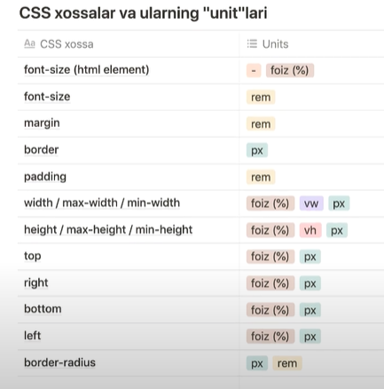
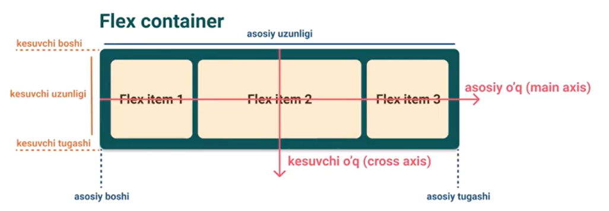

# Complete CSS

## 1. Versions

-   CSS 1.0 - 1996
-   CSS 2.0 - 1998
-   CSS 3.0 - 1999

## 2. Types

-   ~~Inline styles~~ -> not recommended
-   Internal styles -> no comment
-   **External styles** -> recommended

## 3. Selectors

-   Element (tag)
    p{
    color:red;
    }
-   Class
    .className{
    color:red;
    }
-   ID
    #id{
    color:red;
    }
-   Attribute
    [disabled]{
    color:red;
    }
-   Universal
    \*{
    color: red;
    }

## 4. Specificity

-   Cascading - one style is applied for one HTML element among multiple possible styles
    -   Order: Inline styles > ID > Class > Attribute > Tag

## 5. Inheritance

-   If element doesn't have styles, it inherits from parent elements
-   Some styles are not inherited: [reference](https://stackoverflow.com/questions/5612302/which-css-properties-are-inherited)

## 6. Combinators

-   4 types
    -   Descendant selectors
        -   _div p{}_ -> all p elements inside div get the style
    -   Child selector
        -   _div > p{}_ -> all direct children of the div get the style, not grandchildren, only children
    -   Adjacent selectors
        -   _div + p{}_ -> p right after div (its first sibling) gets the style
    -   General sibling selectors
        -   _div ~ p{}_ -> all p siblings after the div get the style

## 7. Multiple classes and combined selectors

-   Lastly declared style (in styless.css) is applied if two competing attributes are given such as two different colors
-   Combined selectors -> a.main => <a class="main"></a>

## 8. !important

-   tag < class, but with !important forces the style on tag: p{color:red !important;} - but it's not recommended if possible!

## 9. Box model

-   margin -> distance between elements' borders
-   padding -> distance between content and border
-   border -> border itself or its size


## 10. Margin collapsing and shorthands

-   Top and bottom margins collapse, but not left and right
-   If two horizontally placed elements both have margins, the greater margin is applied due to margins collapse.


-   shorthands instead of margin-top, margin-bottom, margin-left, margin-right -> margin
-   shorthands -> two values -> top/bottom and left-right values
-   shorthands -> three values -> top, left-right, bottom

## 11. Height and width

-   height
    -   max-height - up to this value, but maybe smaller
    -   min-height - not smaller than this but maybe greater
-   width
    -   max-widht
    -   min-width

## 12. Display

-   It specifies how an element is displayed on page, and has four values:
    -   block
    -   inline
    -   inline block -> inline elements but can have block properties such as margin, padding, border, width, height otherwise impossible to have.
    -   none -> hide the element (do not display)

## 13.Align and float

-   text-align
    -   center, left, right -> align text to center, left, right
-   vertical-align
    -   top, middle, bottom -> align elements to top, middle(center), or bottom vertically
-   horizontal-align
    -   center, left, right
-   float
    -   left and right

## 14. Text-decoration

-   underline
-   line-through
-   none -> no decorations

## 15. Pseudo-classes

-   .heading:hover{} -> mouse-in
-   .heading:active{} -> mouse-clicked
-   ...

-   Grouping rules with comma (,)
    -   .header-main, .header-1 {} -> both classes will have the styles

## 16. Positioning

-   types:

    -   static - default value
    -   relative - relative position
    -   fixed - fixed position relative to the viewport. example: non-moving menu nav bars - if scrolled up/down, the element doesn't move, as it is fixed to the viewport!
    -   absolute - position relative to the positioned (other than static) parent, if no positoined parent found, position relative to the "body" element
    -   sticky - relative + fixed combination

-   z-index

    -   0: default value
    -   applies only on non-static elements

-   overflow
    -   visible: default value
    -   hidden: hides the overflown content
    -   scroll: scrolling functionality for the overflown content
    -   auto: if content overflows, scroll is added, if not - no scroll is added
    -   advanced features:
        -   overflow-x - for horizontal content overflow
        -   overflow-y - for vertical content overflow

## 17. Background image

-   background-image: url(filePath);
-   backgroud-repeat:
    -   repeat (default value)
    -   repeat-x (horizontally repeated)
    -   repeat-y (vertically repeated)
    -   repeat-none (no repeat)
-   backgroud-size:
    -   cover (cover the element)
    -   contain (cover up to image size)
    -   200px 100px (width height values)
-   background-position
    -   top left (start positioning from top left, if one position is give, the next will be center)
-   linear-gradient (to right, white, black) - (to bottom right, blue, red); - (yellow, red, blue)
    radial-gradient (ellipse, red, blue, green); - (circle, yellow, blue, red);
-   filter:
    -   blur(1px) - blurness of the image
    -   brightness(0.3);
    -   contrast(0.5);
    -   grayscale(0.7);
    -   hue-rotate(180deg);
    -   invert(100%);
    -   opacity(50%);
-   border-radius - changing border style of images
-   thumbnail
    border: 1px solid #ccc;
    border-radius: 4px;
    padding:5px;
    opacity: 1 (default), 0 (not visible)

## 18. CSS Units of measurement

-   absolute -> never change the value
    -   px
    -   cm
    -   mm
    -   in
    -   pt
-   relateive -> change value based on device type, etc.

    -   %
        -   depends on position
        -   if position: fixed; % is based on the viewport length
        -   if position: absolute; % is based on (content + padding) length
        -   if position: static or relative; % is based on content length
    -   em -> based on element's or its parent's _font-size_
        -   if font-size: 20px; border-radius: 0.5em; /_ this means 0.5em _ 20px = 10px \*/
        -   if parents don't have font-size, browser default font-size is used (by default: 16px)
        -   use rem for nested elements!
    -   rem -> based on page's (html element) root element's font-size, usually it is 16px
    -   vw, vh (viewport units)
        -   vw -> viewport width -> width: 50vw; (if viewport is 1200px, then width: 600px; which is 50% of viewport width)
        -   vh -> viewport height -> relative to the viewport height, 10vh is equal to 10% of the viewport height
        -   vmin -> % of minimum of vh and vw
        -   vmax -> % of maximum of vh and vw

-   Best practices related to units:
    -   

# 19. Responsive Web Design

-   pixes != pixels (of devices, e.g. iPhone retina displays hold 4 times more pixels in one place)
-   use meta tag to the head element to match pixels
    -   <meta name="viewport" content="width=device-width, initial-scale=1">
-   media queries

    -   @media not|only media-type and (ifodalar)
    -   not or only - often only is used
    -   media-types:
        -   all - all media devices
        -   screen - pc screen, tablets, mobile devices (most used)
        -   print - printers
    -   ifodalar: min-width and max-width

-   mobile first (uses min-width) vs desktop first (uses max-width)
    -   media queries always lastly declared css style is applied if overlapping styles exist.

# 20. Fonts

-   Using fonts for the web-page
-   Font-familoies:
    -   Serif
        -   Times New Roman, Georgia, Garamond
    -   Sans-serif
        -   Arial, Verdana, Helvetica
    -   Monospace
        -   Courier New, Lucida Console, Monaco
    -   Cursive
        -   Brush Script MT, Lucida Handwriting
    -   Fantasy
        -   Copperplate, Papyrus


```
css-selector{
font-family: Helvetica, Arial, sans-serif;
}
```

-   If font-family is used, concrete font is selected from browser font-settings.

```
css-selector{
font-family: sans-serif;
}
```

-   Google fonts usage

```
<link rel="preconnect" href="https://fonts.googleapis.com">
<link rel="preconnect" href="https://fonts.gstatic.com" crossorigin>
<link href="https://fonts.googleapis.com/css2?family=Lato:wght@100;300;400&display=swap" rel="stylesheet">

<style>
body{
    font-family: 'Lato', sans-serif;
}
</style>
```

-   Local fonts usage

```
@font-face{
    font-family: 'Lato';
    src: url('./project/fonts/Lato/Lato-Regular.ttf');
}

@font-face{
    font-family: 'Lato';
    src: url('./project/fonts/Lato/Lato-Bold.ttf');
    font-weight: 700;
}

@font-face{
    font-family: 'Lato';
    src: url('./project/fonts/Lato/Lato-BoldItalic.ttf');
    font-weight: 700;
    font-style: italic;
}

p{
    font-family: 'Lato', sans-serif;
}

h1{
    font-family: 'Lato';
    font-weight: 700;
    font-style: italic;
}
```

-   Font file formats:
    -   TTF -> supported by many browsers
    -   WOFF -> supported by more browsers than ttf
    -   WOFF 2.0 -> zipped form of WOFF and has less size
    -   EOT -> supported by less browsers

```
@font-face{
    font-family: 'Lato';
    src: url('./project/fonts/Lato/Lato-Regular.ttf') format('truetype),
    url('./project/fonts/Lato/Lato-Bold.ttf') format('truetype),
    url('./project/fonts/Lato/Lato-BoldItalic.ttf') format('truetype),

}
```

-   Font Transformers can help generate different font formats

    -   www.transfonter.org

-   Font properties

    -   font-style
        -   normal : default
        -   oblique : faux (neraly) italic
        -   italic : italic
    -   font-weight

        -   normal (default)
        -   bold
        -   bolder

        -   100: thin
        -   200: light
        -   ...
        -   900: bolder

    -   line-height
        -   normal (default)
        -   in number (multipled by font-size) -> 1.6 => 1.6 \* 16px
        -   in px, em, ... -> 16px
        -   in % (multipled by font-size) -> 90% => 16px \* 0.9
    -   letter-spacing
        -   -2px
        -   4px
        -   -5px

# 21. CSS Advanced.

## 2D transforms

-   rotate()
    -   positive number: rotate in clockwise direction
    -   negative number: rotate against the clock direction
        ```
        transform: rotate(45deg);
        transform-origin: top left;
        ```
    -   transform-origin: starting point for rotation;
-   translate()
    -   move element to x,y direction by pixels (etc.)
        ```
            transform: translate(15px, 25px);
        ```
-   scale()
    -   scale the element's height and width by times
    -   has specific scaleX(), scaleY() methods
        ```
        transform: scale(0.5, 0.25);
        ```
-   skew()
    -   has specific skewX(), skewY() methods
        ```
        transform: skew(20deg, 0deg);
        ```

## 3D transforms

-   rotate3d()
    -   tranform: rotate3d(x-value, y-value, z-value, degree)
    -   can have `perspective(100px)` form
    -   has specific methods: rotate3dX(), rotate3dY(), rotate3dZ()
    -   reference: [link](https://developer.mozilla.org/en-US/docs/Web/CSS/transform-function/rotate3d)
        ```
        tranform: rotate3d(1, 2, -1, 30deg);
        ```
-   translate3d()
    -   transform: translate3d(10px, 20px, 30px)
        -   z-value : zoom-in (positive) or zoom-out (negative)
-   scale3d()
    -   transform: scale3d(2, 3, 4)
        -   reference: [link](https://developer.mozilla.org/en-US/docs/Web/CSS/transform-function/scale3d)

# 22. Transitions

## General usage

-   controlling the change that happens within given time period
-   ex: `:hover` event happens immediately when mouse enters onto the element, but with transition we can control the delay of the event / or animate the event
    ```
    .box{
        width: 200px;
        height: 200px;
        background-color: red;
        transition: width 2s, background-color 4s;
    }
    .box:hover{
        width: 400px;
        background-color: green;
    }
    ```
-   transition: all xs;
    -   applys to all properties
-   some elements don't have transition effect

## Transition timing function

-   ease
-   linear
-   ease-in
-   ease-out
-   ease-in-out
-   cubic-bezier(x,y,z,k)

## Transition delay

-   used for delaying transition effects
-   transition-delay: xs;

# 23. Animations

-   keyframes

    ```
    @keyframes animationName{
        0%{

        }
        100%{

        }
    }
    ```

-   Animation direction
-   it works if only there is positive number set for animation-iteration-count

    -   normal
    -   reverse
    -   alternate
    -   alternate-reverse

-   Animation fill mode

    -   none (default)
    -   forwards
    -   backwards
    -   both

-   Animation in one line
    animation: box-mover 4s linear 2s 2 backwards alternate running;

# 24. Flexbox

-   position elements without the use of position or/and float
-   flex-container

    -   contains flex-items
    -   main axis
    -   main start/end
    -   main size
    -   cross start/end
    -   cross axis
    -   cross size

    

-   Flexbox properties:
    -   flex-direction
        -   sets direction for main axis
        -   row
        -   row-reverse
        -   column
        -   column-reverse
    -   flex-wrap
        -   wraps content if it overflows the screen size
        -   nowrap
        -   wrap
        -   wrap-reverse
-   flex-flow
    -   flex-direction + flex-wrap in one line
        -   flex-flow: column wrap;
-   justify-content - flex-start - flex-end - center - space-between - space-around - space-evenly

    

-   Align items
    -   stretch
    -   center
    -   flex-start
    -   flex-end
-   Align content

    -   stretch
    -   flex-start
    -   flex-end
    -   space-between
    -   space-aroudn
    -   space-evenly

-   Flex-container child properties
    -   order: numberValue
        -   sorts elements based on order value -> ascending order
    -   flex-grow: numberValue
        -   grows the elemts to fill the space
    -   flex-shrik: numberValue
        -   default : 1
        -   opposite effect of flex-grow
