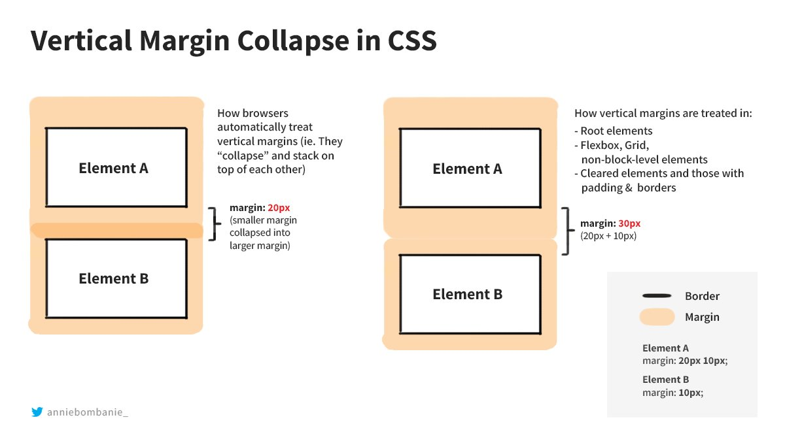

# Complete CSS

## 1. Versions

- CSS 1.0 - 1996
- CSS 2.0 - 1998
- CSS 3.0 - 1999

## 2. Types

- ~~Inline styles~~     -> not recommended
- Internal styles       -> no comment
- **External styles**   -> recommended

## 3. Selectors

- Element (tag) 
    p{
        color:red;
    }
- Class
.className{
        color:red;
    }
- ID
#id{
    color:red;
}
- Attribute
[disabled]{
    color:red;
}
- Universal
*{
    color: red;
}

## 4. Specificity

- Cascading - one style is applied for one HTML element among multiple possible styles
    - Order: Inline styles > ID > Class > Attribute > Tag

## 5. Inheritance

- If element doesn't have styles, it inherits from parent elements
- Some styles are not inherited: [reference](https://stackoverflow.com/questions/5612302/which-css-properties-are-inherited)

## 6. Combinators

- 4 types
    - Descendant selectors
        - *div p{}*   -> all p elements inside div get the style
    - Child selector
        - *div > p{}* -> all direct children of the div get the style, not grandchildren, only children
    - Adjacent selectors
        - *div + p{}* -> p right after div (its first sibling) gets the style
    - General sibling selectors
        - *div ~ p{}* -> all p siblings after the div get the style

## 7. Multiple classes and combined selectors

- Lastly declared style (in styless.css) is applied if two competing attributes are given such as two different colors
- Combined selectors -> a.main => 

## 8. !important
- tag < class, but with !important forces the style on tag: p{color:red !important;} - but it's not recommended if possible!

## 9. Box model

- margin    -> distance between elements' borders
- padding   -> distance between content and border   
- border    -> border itself or its size

## 10. Margin collapsing and shorthands

- Top and bottom margins collapse, but not left and right
- If two horizontally placed elements both have margins, the greater margin is applied due to margins collapse. 

- shorthands instead of margin-top, margin-bottom, margin-left, margin-right -> margin 
- shorthands -> two values -> top/bottom and left-right values
- shorthands -> three values -> top, left-right, bottom

## 11. Height and width

- height
    - max-height    - up to this value, but maybe smaller
    - min-height    - not smaller than this but maybe greater
- width
    - max-widht     
    - min-width

## 12. Display
- It specifies how an element is displayed on page, and has four values:
    - block
    - inline
    - inline block  -> inline elements but can have block properties such as margin, padding, border, width, height otherwise impossible to have. 
    - none  -> hide the element (do not display)
    